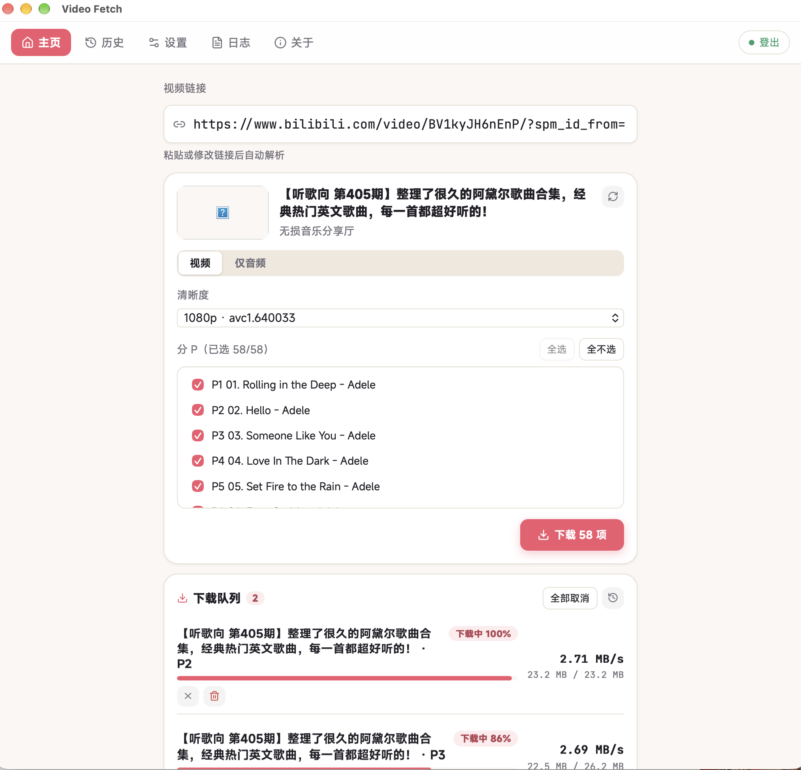

# Video Fetch

<p align="center">
  
</p>

<p align="center">
  English | <a href="README.md">简体中文</a>
</p>

<p align="center">
  <a href="./LICENSE"></a>
  <a href="https://github.com/asthetik/video-fetch/actions/workflows/ci.yml"></a>
  <a href="https://github.com/asthetik/video-fetch/releases"></a>
  <a href="https://github.com/asthetik/video-fetch/releases"></a>
</p>

Video Fetch (影取) is a lightweight desktop video downloader, currently supporting Bilibili. Paste a link, click download.

<p align="center">
  
</p>

## What it can do

- Paste a Bilibili video link and the app lists the available qualities; pick one and download
- Multi-part videos: check the episodes you want and download them all at once
- Paste a creator’s page link to list every upload; search, sort, and check across pages to add them to the download queue in one go
- Video / audio-only modes: audio-only lets you pick the quality tier (64/132/192 kbps AAC, Hi-Res lossless) and output format (m4a / mp3 / FLAC; FLAC is only available for Hi-Res sources)
- Sign in to Bilibili to download Premium-exclusive qualities
- Downloads run in a queue (concurrency limit adjustable in 设置 → 下载); pause, resume, cancel, retry, and the full history are always available
- The download engine ships with the installer: nothing extra to set up

## Install

1. Open the [Releases](https://github.com/asthetik/video-fetch/releases) page
2. Download the installer for your system:
   - macOS (Apple silicon only): `Video-Fetch-v*-macOS.dmg`
   - Windows x64: `Video-Fetch-v*-Windows-x64.msi` / `.exe`
   - Windows arm64: `Video-Fetch-v*-Windows-arm64.msi` / `.exe`
   - Linux x86_64: `Video-Fetch-v*-Linux-x86_64.AppImage` / `.deb`
   - Linux arm64: `Video-Fetch-v*-Linux-arm64.AppImage` / `.deb`
3. Install and open the app

The installers are **not code-signed**, so your system will show a warning the first time you open the app. Follow the steps below.

### macOS

If you see "Video Fetch.app is damaged and can’t be opened", don’t worry: the app is not damaged, macOS is just blocking an unsigned app. Drag the app into Applications, then run this in Terminal:

```bash
xattr -cr "/Applications/Video Fetch.app"
```

Then open it again.

### Windows

If SmartScreen shows "Unknown publisher", click "Run anyway".

### Linux

A `.AppImage` usually runs as-is; if it complains about missing execute permission, run:

```bash
chmod +x Video-Fetch-*-Linux-*.AppImage
```

## Usage

1. Paste a video link and wait for it to resolve; pasting a creator’s page link lists all of their uploads
2. Pick a quality (for multi-part videos you can also check episodes); switch to 「仅音频」 (Audio only) to pick the audio quality and output format
3. Click download

Want Premium qualities? Sign in to Bilibili inside the app, or import a `cookies.txt` file manually.

Files are saved to your system Downloads folder by default; you can change that in 设置 → 下载 → 保存目录 (Settings → Download → Save folder). If the system Downloads folder can’t be resolved, files fall back to `downloads/` inside the app data folder.

## Logs and privacy

- The app records your actions (resolving, downloading, settings) to local log files
- The in-app 「日志」 (Logs) page lets you view the logs, open the log directory, and clear the logs
- Sign-in cookies are stored in a local file (owner-only permissions on macOS and Linux)
- Download history and settings live in the same folder

App data folder locations:

| System | Location |
|--------|----------|
| macOS | `~/Library/Application Support/app.videofetch.desktop/` |
| Windows | `%APPDATA%\app.videofetch.desktop\` |
| Linux | `~/.local/share/app.videofetch.desktop/` |

---

## Development

### Tech stack

- Desktop framework: Tauri 2 — Rust backend (edition 2024, minimum 1.90), React 19 + TypeScript + Vite frontend
- Download engine: yt-dlp + ffmpeg, shipped as sidecar subprocesses inside the installers (sidecar: an external binary bundled with the app)
- Local storage: SQLite (download history and queue) plus log files

### Local environment

- Node.js 24
- Rust 1.90 or newer
- Python 3.14 (pinned in `.python-version`, used to fetch the sidecars)
- Linux also needs the Tauri system dependencies (Ubuntu / Debian): libwebkit2gtk-4.1-dev, libappindicator3-dev, librsvg2-dev, patchelf, xdg-utils

### Quick start

```bash
npm install
python3 scripts/fetch_sidecars.py
npm run tauri dev
```

Don’t skip the second step: it downloads the yt-dlp and ffmpeg binaries for your platform into `src-tauri/binaries/`, which is where the dev build loads them from. If you already have system copies you’d rather use, point `YT_DLP_PATH` / `FFMPEG_PATH` at them.

### Common commands

| Command | What it does |
|---------|--------------|
| `npm run tauri dev` | Launch the desktop app (dev mode) |
| `npm run build` | Type-check and build the frontend |
| `npm run test` | Frontend unit tests |
| `cargo test --manifest-path src-tauri/Cargo.toml` | Backend tests |
| `cargo fmt --manifest-path src-tauri/Cargo.toml --all` | Format the backend code |
| `cargo clippy --manifest-path src-tauri/Cargo.toml --all-targets -- -D warnings` | Lint the backend |

### Integration / stress tests (fetch the sidecars first)

```bash
# Deterministic regression suite (what CI runs, serial; run before pushing engine changes)
cargo test --manifest-path src-tauri/Cargo.toml --features test-utils --test regression -- --test-threads=1

# Long soak test (local, 5 minutes by default; SOAK_SEED reproduces the operation sequence)
SOAK_MINUTES=10 cargo test --manifest-path src-tauri/Cargo.toml --features test-utils --test soak -- --ignored --nocapture
```

### Pre-push checks

After touching the download engine, run the same gates as CI locally before pushing: fmt + clippy (default and with `--features test-utils`) + unit tests + the regression suite (serial).

```bash
cargo fmt --manifest-path src-tauri/Cargo.toml --all -- --check
cargo clippy --manifest-path src-tauri/Cargo.toml --all-targets -- -D warnings
cargo clippy --manifest-path src-tauri/Cargo.toml --features test-utils --all-targets -- -D warnings
cargo test --manifest-path src-tauri/Cargo.toml
cargo test --manifest-path src-tauri/Cargo.toml --features test-utils --test regression -- --test-threads=1
```

### Project layout

```
src/                    Frontend: pages / components / lib
src-tauri/src/          Backend: commands, download, ytdlp, wbi, settings, activity_log, ...
src-tauri/binaries/     Dev-mode sidecars (not committed)
scripts/                Sidecar fetch/verification and release helper scripts
.github/workflows/      CI and release workflows
```

## License

Apache-2.0. See [`LICENSE`](./LICENSE).
