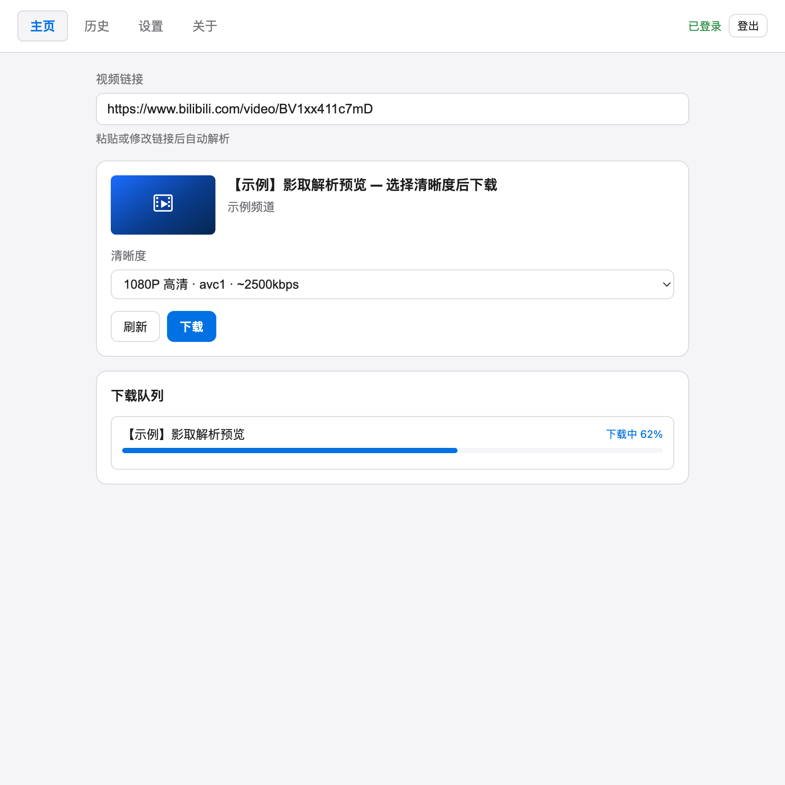

# 影取（VideoFetch）

轻量桌面视频下载器。当前支持哔哩哔哩（B 站）。

  

## 快速安装

1. 打开本仓库 [Releases](https://github.com/asthetik/videofetch/releases)
2. 下载对应系统的安装包（macOS `.dmg` / Windows `.msi` 或 `.exe` / Linux `.AppImage`）
3. 安装或解压后运行

未做代码签名时，系统可能提示「未验证开发者」或 SmartScreen；按系统提示允许一次即可。

## 快速下载

1. 粘贴视频链接并解析  
2. 选择清晰度（及分 P）  
3. 开始下载  

需要大会员清晰度时，可在应用内登录 B 站或导入 cookies。

安装包**内置 yt-dlp / ffmpeg**，一般无需另行安装。第三方许可证见 [`THIRD_PARTY.md`](./THIRD_PARTY.md)。

## 许可证

Apache-2.0。详见 [`LICENSE`](./LICENSE)。
