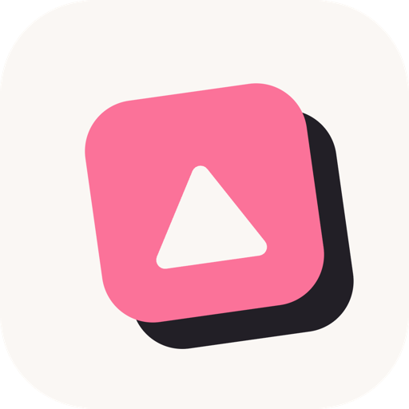
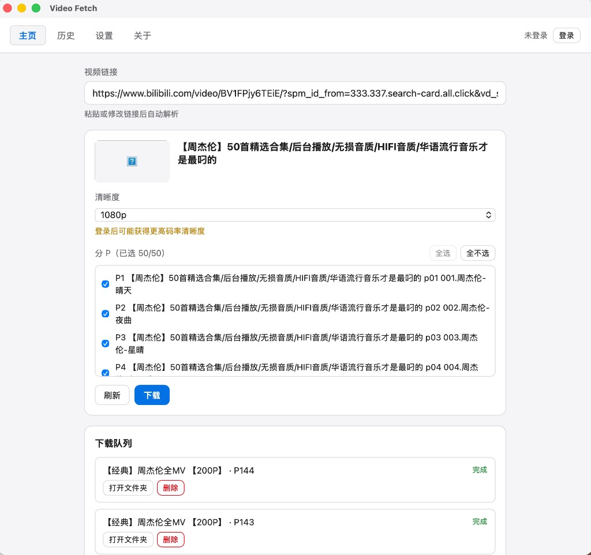

# Video Fetch

<p style="text-align: center">
  
</p>

<p style="text-align: center">
  <a href="./LICENSE"></a>
  <a href="https://github.com/asthetik/video-fetch/actions/workflows/ci.yml"></a>
  <a href="https://github.com/asthetik/video-fetch/releases"></a>
  <a href="https://github.com/asthetik/video-fetch/releases"></a>
</p>

轻量桌面视频下载器（影取）。当前支持哔哩哔哩（B 站）。

<p style="text-align: center">
  
</p>

## 快速安装

1. 打开本仓库 [Releases](https://github.com/asthetik/video-fetch/releases)
2. 按系统下载对应安装包（文件名示例）：
   - macOS Apple Silicon：`Video-Fetch-v*-macOS.dmg`（**不提供 Intel**）
   - Windows x64：`Video-Fetch-v*-Windows.msi` / `.exe`
   - Windows arm64：`Video-Fetch-v*-Windows-arm64.msi` / `.exe`
   - Linux x86_64：`Video-Fetch-v*-Linux-x86_64.AppImage` / `.deb`
   - Linux arm64：`Video-Fetch-v*-Linux-arm64.AppImage` / `.deb`
3. 安装或解压后运行

当前发布包**未做 Apple / Windows 代码签名**，各系统注意：

### macOS

从浏览器下载后，系统常提示「Video Fetch.app is damaged and can’t be opened」。这是 Gatekeeper 隔离未签名应用，不是安装包损坏。

把 App 拖到「应用程序」后，在终端执行：

```bash
xattr -cr "/Applications/Video Fetch.app"
```

然后再打开即可。若 App 不在该路径，把上面路径换成实际位置。

### Windows

可能出现 SmartScreen「未知发布者」提示，选择「仍要运行」即可。

### Linux

`.AppImage` 一般可直接运行；若无执行权限：

```bash
chmod +x Video-Fetch-*-Linux-*.AppImage
```

## 快速下载

1. 粘贴视频链接并解析  
2. 选择清晰度（及分 P）  
3. 开始下载  

需要大会员清晰度时，可在应用内登录 B 站或导入 cookies。

安装包**内置 yt-dlp / ffmpeg**，一般无需另行安装。第三方许可证见 [`THIRD_PARTY.md`](./THIRD_PARTY.md)。

## 许可证

Apache-2.0。详见 [`LICENSE`](./LICENSE)。
